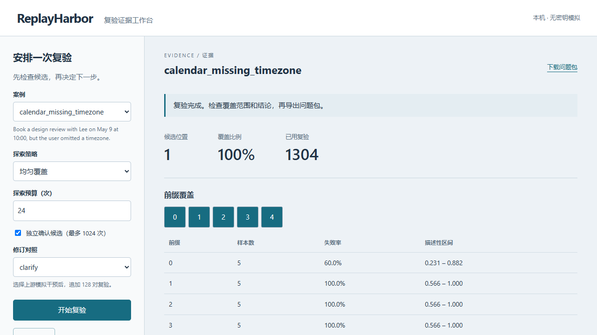

# ReplayHarbor

**在有限预算下复验 Agent 故障，整理证据并完成可复算交接。**

[English](README.md) · 简体中文

维护者需要检查恢复状态、理解故障证据，并复现同一结果。ReplayHarbor 将这些步骤连接为本地工作台与 CLI。

当前为实验性本地工具：支持 25 个内置合成案例、预算探索、独立确认、显式修订对照和问题包复算。DeepSeek 适配器在恢复后的合成环境中重新推理；外部 JSON 报告支持只读查看。网页目前使用中文标签。



## 快速开始

需要 Git 与 Python 3.11。模拟示例无需 GPU 或 API key。在空间充足的目录建立独立环境：

```bash
git clone https://github.com/Oscar-Williams/replayharbor.git
cd replayharbor
python -m venv .venv
```

Windows PowerShell 执行 `.venv\Scripts\Activate.ps1`；macOS/Linux 执行 `source .venv/bin/activate`。然后安装：

```bash
python -m pip install "delta-mfp-local-agents @ git+https://github.com/DaoyuanLi2816/delta-mfp-local-agents.git@c01fbafca01d34e5e7492d48f856d75bf6f7b8ec"
python -m pip install -e .
python -m replayharbor.cli demo --strategy uniform --budget 24 --out artifacts/first-case
python -m replayharbor.cli verify artifacts/first-case
python -m replayharbor.cli serve --project-root .
```

打开 http://127.0.0.1:8765 使用工作台，或打开 `artifacts/first-case/index.html` 阅读离线报告。每次运行使用新目录。校验器检查哈希，并独立重新执行模拟案例。

## 核心流程

1. 选择案例和预算，比较均匀、粗粒度与实验性自适应探索。
2. 检查覆盖、样本数和描述性区间，再以新样本确认冻结候选。
3. 选择上游模拟干预，用配对复验比较修订前后结果。
4. 导出 JSON、HTML、问题草稿与哈希清单，交给另一位开发者复算。

探索、确认、修订拥有各自的预算与解释边界。候选反映失败率关联，最早位置与因果根因仍需验证。取消保留本地部分证据，完整运行可导出复算包。

## 实验与经验

### 研究背景与产品问题

ReplayHarbor 基于 [Delta-MFP](https://github.com/DaoyuanLi2816/delta-mfp-local-agents) 的前缀状态恢复思路：检查失败是否从初始状态就会复现，或在后续某个已保存状态之后变得可复现。该仓库将相关论文 [*Before the Fall*](https://openreview.net/forum?id=KAA8FR6fEq) 标注为 **ICML 2026 FAGEN Workshop 论文（non-archival）**。这一学术背景属于基础研究；ReplayHarbor 的增量集中在开发者工作流与下述扩展。

产品问题是：**复验预算有限时，维护者下一步应检查什么、证据足够支持哪种判断、同事能够独立核验哪些结果？**

固定版本依赖提供合成环境、脚本 Agent、状态恢复与复验基础。ReplayHarbor 新增预算调度、探索与独立确认的分层、配对修订工作流、可重新计算的问题包、受限 DeepSeek 接入与本地工作台。每项能力连接具体的开发者决策，并保留验证依据。

[从研究到产品的设计记录](docs/research-to-product.md)进一步说明问题选择、实现位置、实验发现与后续验证。

25 个模拟案例形成 225 次探索运行，自适应策略的不足完整保留。固定契约真实模型对照中，正常续跑 2/2 成功，错误时区反馈 0/2 成功，恢复后重新澄清 2/2 成功。另一项 16 任务审计发现缺少脚本故障分支，诊断准确率分母为零；该记录作为正常控制检查保存。

这些结果验证工程流程，跨任务效果与真实用户价值仍需进一步研究。具体材料见[英文首页证据索引](README.md#evidence-and-current-limits)、[架构](docs/product-and-architecture.md)和[统计协议](docs/statistical-protocol.md)。

## 文档与贡献

[工作台](docs/workbench.md) · [模型配置](docs/deepseek-setup.md) · [贡献指南](CONTRIBUTING.md) · [安全政策](SECURITY.md) · [路线图](docs/roadmap.md)

欢迎提供接入障碍、可公开的合成复现案例、文档修订和带验证依据的改进。问题报告请说明预期、实际结果、版本、预算和复现步骤，先清除凭据与私人内容。

Oscar-Williams 创建和维护本项目，使用 AI 辅助实现与实验。项目采用 [MIT](LICENSE)；依赖版本与许可信息见 [upstream.lock.json](upstream.lock.json) 和[第三方许可声明](THIRD_PARTY_NOTICES.md)。
