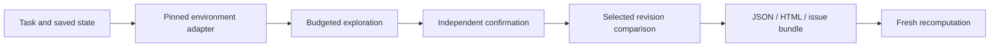

# Architecture and design decisions

## User workflow

A maintainer receives an agent failure report and needs enough evidence to choose the next check and hand the case to a colleague. ReplayHarbor makes restoration conditions, replay budgets and result interpretation visible in one local workflow.

The scheduler receives prefix count and observed failures. Evaluation labels and fault-injection positions stay outside its API. Every prefix remains eligible even when the failure curve is nonmonotonic. Prefix-zero recurrence anchors candidate selection.

## Decisions and tradeoffs

1. **Separate exploration from confirmation.** Adaptive descriptive intervals help organize inspection; fresh fixed-size samples evaluate one frozen candidate under stated assumptions.
2. **Count failed attempts.** Environment errors consume replay budget and preserve the incomplete evidence state.
3. **Make restoration explicit.** Scripted replay restores environment and agent state. Real-model continuation restores environment and observed history, then requests new inference. Recorded-output viewing is a separate operation.
4. **Prefer inspectable defaults.** The workbench defaults to uniform coverage; adaptive scheduling remains experimental because existing results expose weaknesses. CLI strategy can be chosen explicitly.
5. **Keep the first boundary small.** Built-in synthetic execution and read-only external reports make installation and verification tractable. Executable private traces require a versioned restoration and redaction contract.
6. **Verify handoff independently.** Checksums detect modified bytes; recomputation checks the synthetic report against its execution conditions.

The workbench uses Python's standard HTTP server and static browser assets. Jobs run in memory with cancellation signals. Fixed routes, loopback binding, origin checks and export inspection support local use. Multi-user hosting needs authentication, persistence and task isolation.

## Product validation

Useful measures include first-example completion, bundle recomputation success, covered prefixes per budget, uncertain-result frequency, model calls and handoff completeness. Automated checks establish software behavior. Real user trials are needed to measure adoption or support-time savings. The [trial protocol](developer-trial.md) records task outcomes and obstacles without inventing feedback.

Evaluation records retain negative and inapplicable results. In particular, the reserved task audit found an all-normal scripted contract: a zero positive denominator prevents an accuracy claim. See the [evidence index](../README.md#evidence-and-current-limits).
